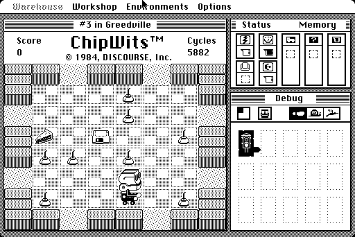

# ChipWits Macintosh Source Disks

This repository contains Macintosh raw disk images from the archives
of the original author of ChipWits, Doug Sharp.

# Screenshot

# MacForth

The source code for ChipWits was written in MacForth, a version of the Forth programming language.
This repository does not contain the MacForth compiler or runtime, but you can find more information
about MacForth at the [Macintosh Repository](https://www.macintoshrepository.org/49896-macforth-plus).

# Disks

The following disks have been restored. The directory names match the
labels on the disks.

These disks were imaged by John Morris, using Applesauce. The images are in the `.dc42` format.

The one exception is `CW Source From Fan` which was imaged on a PowerBook G3 Wallstreet. As it was
already returned to the fan, there was no way for John to image it.

| Disk                     | Notes                                                                                                                                              |
|--------------------------|----------------------------------------------------------------------------------------------------------------------------------------------------|
| CW Source From Fan       | Disk provided by a fan of the game, to whom Doug gave a copy of the source code.                                                                   |
| CW+ Work Final Src       | Final source code for ChipWits                                                                                                                     |
| CW+ 800K                 | Disk labeled CW+                                                                                                                                   |
| CW Programs              | Full label: 2 ChipWits in Greedville 1 in Octopus Garden First CW in Greedville goes into all rooms second tests for can and disk before going in. |
| ChipWits 1.1 Drexel Demo |                                                                                                                                                    |
| Adventure Creation Disk  |                                                                                                                                                    |
| CW Demo Release          |                                                                                                                                                    |
| ChipWits MacPaint Files  |                                                                                                                                                    |
| CW Demo                  |                                                                                                                                                    |
| CW+ 400K (damaged)       | This disk had physical damage                                                                                                                      |
| CW+ Copy 1               |                                                                                                                                                    |
| CW Work I Bak            |                                                                                                                                                    |
| CW Work I                |                                                                                                                                                    |
| CW Work II               |                                                                                                                                                    |
| CW Work (II) 8-1-85      |                                                                                                                                                    |

# Opening the Disks

The disks can be opened in a Mac emulator such as [Mini vMac](https://www.gryphel.com/c/minivmac/).
You need to boot with a system disk first. Some of these disks have the system installed as well, others don't.

# Readable FORTH Source
The `forth/` directory contains semi-recovered source code, re-encoded so that it can be
read by a modern computer. The code is non-normative and will not compile.
